#  NovaBazaar — Autonomous E-Commerce & Agentic Revenue Recovery Platform

[](https://razor-pay-agentic-ai.vercel.app)
[](https://nextjs.org/)
[](https://react.dev/)
[](https://ai.google.dev/)
[](https://razorpay.com/)
[](https://www.typescriptlang.org/)

> **NovaBazaar** is an end-to-end agentic e-commerce platform combining an **AI Buyer Shopping Assistant** with an **Autonomous Merchant Revenue Agent**. It bridges intelligent conversational commerce with deterministic merchant policy controls and real-time Razorpay payment recovery revalidation.

---

##  Key Highlights & Live Links

*  **Production App URL**: [https://agent-ai-six-iota.vercel.app](https://agent-ai-six-iota.vercel.app)
*  **Merchant Revenue Dashboard**: [https://agent-ai-six-iota.vercel.app/revenue](https://agent-ai-six-iota.vercel.app/revenue)
*  **Payment Gateway Integration**: Razorpay Test Mode Payment Links & Cryptographic HMAC SHA-256 Webhooks
*  **Security Model**: Server-authoritative Single Source of Truth — client state spoofing strictly disallowed.

---

##  System Architecture

NovaBazaar is built around a **Dual Agentic Architecture** separating buyer-side conversational discovery from merchant-side autonomous revenue recovery.

```mermaid
flowchart TD
    subgraph BuyerExperience["🛒 Buyer Shopping Experience"]
        A[Customer Utterance / Voice Input] --> B[Intent Extraction Engine]
        B --> C[BuyerAgent - Gemini LLM Tool Loop]
        C --> D[Catalog Search & Grounding Check]
        D --> E[Pair Companion Accessory Recommendation]
        E --> F[Unified Cart Management]
        F --> G[Purchase Proposal Generation]
        G --> H[Human Approval Gate]
        H --> I[Razorpay Test Checkout Modal]
    end

    subgraph MerchantExperience[" Merchant Revenue Recovery Experience"]
        J[Failed Payment / Abandoned Cart Event] --> K[RevenueAgent Transaction Analysis]
        K --> L{Deterministic Policy Engine Bounds Check}
        L -- Disallowed / Exceeds Ceiling --> M[ Policy Rejected / Abstained]
        L -- Allowed & > ₹500 --> N[ Human Merchant Approval Required]
        L -- Allowed & ≤ ₹500 --> O[ Auto-Action Eligible]
        N -- Merchant Sign-off --> P[RevenueActionTool Execution]
        O --> P
        P --> Q[Razorpay Payment Link Creation]
        Q --> R[Customer Receives Link rzp.io]
        R --> S[Customer Pays via Razorpay Test Checkout]
        S --> T[Razorpay payment_link.paid Webhook]
        T --> U[HMAC SHA-256 Signature Verification & Idempotency Check]
        U --> V[PaymentStore State Transition: FAILED ➔ RECOVERED]
        V --> W[PAYMENT_RECOVERED Audit Log]
        W --> X[Dashboard 3s Polling Detection ➔  PAYMENT RECOVERED]
    end
```



---

##  Project File Structure

```text
RazorPay-AgenticAI/
├── app/                                  # Next.js 16 App Router Routes & API Endpoints
│   ├── api/                              # REST API Route Handlers
│   │   ├── agent/
│   │   │   ├── buyer/                    # Buyer Agent API endpoints
│   │   │   │   ├── chat/route.ts         # Multi-turn chat & tool execution handler
│   │   │   │   └── route.ts              # One-shot buyer search handler
│   │   │   └── revenue/
│   │   │       └── action/route.ts       # Revenue action tool execution handler
│   │   ├── cart/route.ts                 # Server-side cart management endpoint
│   │   ├── catalog/
│   │   │   └── products/                 # Product catalog APIs
│   │   ├── intent/route.ts               # Conversational intent parsing API
│   │   ├── payment/
│   │   │   ├── create-order/route.ts     # Razorpay order creation endpoint
│   │   │   ├── verify/route.ts           # Razorpay HMAC signature verification endpoint
│   │   │   └── webhook/route.ts          # Razorpay payment_link.paid webhook handler
│   │   ├── purchase/
│   │   │   └── proposal/                 # Purchase proposal creation & approval handlers
│   │   └── revenue/
│   │       ├── analyze/route.ts          # Revenue Agent opportunity diagnosis endpoint
│   │       ├── approve/route.ts          # Merchant human approval endpoint
│   │       └── status/route.ts           # Realtime 3s polling status endpoint
│   ├── catalog/page.tsx                  # Interactive Developer Catalog page
│   ├── revenue/page.tsx                  # Merchant Revenue Recovery Dashboard page
│   ├── layout.tsx                        # Root layout component
│   └── page.tsx                          # Main NovaBazaar Buyer Application & Shopping Interface
├── components/                           # React UI Components
│   ├── agent/                            # Agentic UI Widgets & Indicators
│   │   ├── AgentHeader.tsx               # Voice/Agent status bar header presence
│   │   ├── AgentPanel.tsx                # Merchant dashboard agent control panel
│   │   ├── AgentVoiceOrb.tsx             # Dynamic animated voice orb state indicator
│   │   ├── ProposalCard.tsx              # Purchase proposal review & approval card
│   │   └── RevenueRecoveryWidget.tsx     # Merchant recovery card widget
│   └── catalog/                          # Shopping UI Components
│       ├── CartPanel.tsx                 # Live shopping cart panel with item operations
│       └── ChatShoppingPanel.tsx         # Adam AI voice & text chat shopping interface
├── lib/                                  # Business Logic, Services, & Agent Engines
│   ├── agent/
│   │   ├── buyer/                        # Buyer Shopping Agent logic & schemas
│   │   └── revenue/                      # Revenue Recovery Agent & Policy Engine
│   ├── audit/                            # Audit log recorder service
│   ├── cart/                             # In-memory CartService
│   ├── catalog/                          # Product catalog service & authoritative data
│   ├── intent/                           # Intent classification service
│   ├── money/                            # Rupee currency formatting utilities
│   ├── payment/                          # Razorpay API provider, store & signature verifier
│   ├── purchase/                         # Server-side PurchaseProposal & approval service
│   ├── session/                          # Multi-turn voice session orchestration & reference resolver
│   ├── tools/
│   │   └── catalog/                      # Gemini Catalog Tools (search, add, checkout, recommend)
│   └── voice/                            # WebSpeech voice provider & wake word detector
├── types/                                # TypeScript Type Definitions & Schemas
│   ├── agent.ts                          # Agent session & state types
│   ├── audit.ts                          # Audit event schemas
│   ├── catalog.ts                        # Product & inventory types
│   ├── intent.ts                         # Purchase intent types
│   ├── payment.ts                        # Razorpay transaction & webhook types
│   └── purchase.ts                       # Proposal & checkout types
├── public/                               # Static Product & Branding Image Assets
├── README.md                             # Comprehensive Project Documentation
└── package.json                          # Dependencies & Scripts Configuration
```

---

## ⚡ Core Features

### 1.  Autonomous AI Buyer Shopping Assistant
* **Natural Language Shopping**: Extracts purchase intent, capacity, material, category, and budget constraints from conversational text or speech.
* **Paired Companion Accessory Recommendations**: Automatically suggests complementary accessories (e.g. recommending an aluminum headphone stand for over-ear headphones).
* **Instant Cart Operations**: AI tool registry directly executes cart additions, updates, removals, and multi-item checkout proposals.
* **Human Approval Gate**: Every purchase proposal requires explicit customer sign-off before financial orders are instantiated.

### 2.  Merchant Revenue Recovery Agent
* **Autonomous Opportunity Diagnosis**: Continuously inspects merchant transactions, diagnosing failure causes (e.g. gateway timeouts, OTP expirations, abandoned carts).
* **Deterministic Policy Engine**: Enforces strict financial rules overriding any LLM hallucination risk:
  *  **Discount Ceiling**: Maximum 10% discount allowance.
  *  **Retry Cooldown**: 30-minute minimum cooldown between payment retry attempts.
  *  **Max Retries**: Hard limit of 2 retry attempts per transaction.
  *  **Human Sign-off Ceiling**: Any transaction or recovery exceeding **₹500** strictly requires human merchant approval.
* **Server-Authoritative Razorpay Payment Links**: Generates real Razorpay recovery payment links (`https://rzp.io/rzp/...`) for approved opportunities.
* **Real-Time Webhook Revalidation (3-Second Polling)**: The dashboard polls `/api/revenue/status` every 3 seconds while a recovery link is pending (`LINK_CREATED` / `PAYMENT_PENDING`). When Razorpay's `payment_link.paid` webhook arrives, backend state transitions from `FAILED` to `RECOVERED`, automatically updating the UI to **` PAYMENT RECOVERED`** without full page reloads.

---

##  Merchant Lifecycle States

Every transaction card on the Merchant Dashboard clearly displays its progression:

| Lifecycle State | Badge | Trigger / Description |
| :--- | :--- | :--- |
| **Opportunity Identified** | `Opportunity Identified` | Failure or cart abandonment detected by Revenue Agent. |
| **Approval Required** | ` Approval Required (>₹500)` | Amount exceeds ₹500 threshold; requires merchant sign-off. |
| **Auto-Action Eligible** | ` Auto-Action Eligible (≤₹500)` | Amount is ≤₹500; auto-executable within policy bounds. |
| **Policy Rejected** | ` Policy Rejected` | Action violates policy bounds (e.g., cooldown active or max retries exceeded). |
| **Payment Pending** | ` PAYMENT PENDING` | Razorpay Payment Link generated; awaiting customer checkout payment. |
| **Payment Recovered** | ` PAYMENT RECOVERED` | Verified via Razorpay `payment_link.paid` webhook; displays Razorpay Payment ID & timestamp. |

---

##  Security & Single Source of Truth

* **Cryptographic HMAC SHA-256 Webhook Verification**: All incoming webhooks pass through `RazorpayService.verifyWebhookSignature`, comparing `x-razorpay-signature` against request raw body using timing-safe buffer comparison.
* **Webhook Idempotency Guarantee**: Prevents duplicate webhook processing using `PaymentStore.hasProcessedWebhookEvent`.
* **Zero Client Status Spoofing**: Clicking or opening a Razorpay link ONLY reflects `PAYMENT PENDING`. Transition to `RECOVERED` occurs strictly server-side upon verified webhook receipt.
* **Rupee Currency Standard**: All financial values in the UI are formatted natively in Indian Rupees (**₹699**), preventing paise display clutter (69,900 paise kept strictly in audit metadata).

---

##  API Reference

| Endpoint | Method | Description |
| :--- | :--- | :--- |
| `/api/revenue/analyze` | `POST` | Executes `RevenueAgent` across synthetic merchant records and evaluates policy bounds. |
| `/api/agent/revenue/action` | `POST` | Executes `RevenueActionTool`, calling `RazorpayService.createRecoveryPaymentLink`. |
| `/api/revenue/status` | `GET` | Returns authoritative live transaction statuses from `PaymentStore` & `AuditService` for 3s polling. |
| `/api/payment/webhook` | `POST` | Processes Razorpay webhook events (`payment_link.paid`, `payment.captured`, `payment.failed`). |
| `/api/payment/create-order` | `POST` | Creates Razorpay order for approved buyer purchase proposals. |
| `/api/payment/verify` | `POST` | Verifies buyer checkout HMAC signatures server-side. |
| `/api/intent` | `POST` | Extracts purchase intent and constraints from buyer messages. |
| `/api/agent/buyer` | `POST` | Runs `BuyerAgent` Gemini tool loop for product recommendation and grounding. |
| `/api/catalog/products` | `GET` | Retrieves catalog products with category filtering. |

---

##  Local Development Setup

### 1. Clone & Install Dependencies
```bash
git clone https://github.com/AyushKumar-alt/RazorPay-AgenticAI.git
cd RazorPay-AgenticAI
npm install
```

### 2. Configure Environment Variables
Create a `.env.local` file in the root directory:
```env
# Google Gemini API Key
GEMINI_API_KEY=AIzaSy...

# Razorpay Test Mode Credentials
RAZORPAY_KEY_ID=rzp_test_...
RAZORPAY_KEY_SECRET=...
NEXT_PUBLIC_RAZORPAY_KEY_ID=rzp_test_...
RAZORPAY_WEBHOOK_SECRET=...
```

### 3. Run Development Server
```bash
npm run dev
```
Open [http://localhost:3000](http://localhost:3000) in your browser.

---

##  Automated Test Suites

NovaBazaar includes extensive unit and integration test coverage across all agentic and payment systems:

```bash
# Run Real-Time Dashboard & Webhook Polling Test Suite
npx tsx lib/agent/revenue/revenue-dashboard-realtime.test.ts

# Run Revenue Action Tool Tests
npx tsx lib/agent/revenue/revenue-action-tool.test.ts

# Run Revenue Agent Unit & Integration Tests
npx tsx lib/agent/revenue/revenue.agent.test.ts
npx tsx lib/agent/revenue/revenue-integration.test.ts

# Run Razorpay Webhook & Payment Link Tests
npx tsx lib/payment/webhook.test.ts
npx tsx lib/payment/payment-link.test.ts
npx tsx lib/payment/payment.test.ts

# Run Buyer Agent & Purchase Proposal Tests
npx tsx lib/agent/buyer/buyer.test.ts
npx tsx lib/purchase/purchase.test.ts
```

### Test Coverage Summary
*  **19/19 Passed**: Real-Time Dashboard & Webhook Polling Suite
*  **24/24 Passed**: Revenue Action Tool Suite
*  **12/12 Passed**: Revenue Agent Policy Evaluation Suite
*  **8/8 Passed**: Revenue Integration & Security Suite
*  **10/10 Passed**: Razorpay Webhook Signature & State Machine Suite
*  **10/10 Passed**: Razorpay Payment Link Creation Suite
*  **29/29 Passed**: Buyer Agent & Purchase Proposal Suite

---

##  Production Build & Deployment

NovaBazaar is optimized for deployment on Vercel:

```bash
# Typecheck & Build Production Bundle
npm run build

# Deploy to Vercel Production
npx vercel --prod
```

Live Production Deployment: **[https://agent-ai-six-iota.vercel.app](https://agent-ai-six-iota.vercel.app)**

---

## 📜 License

Distributed under the MIT License. See `LICENSE` for details.
